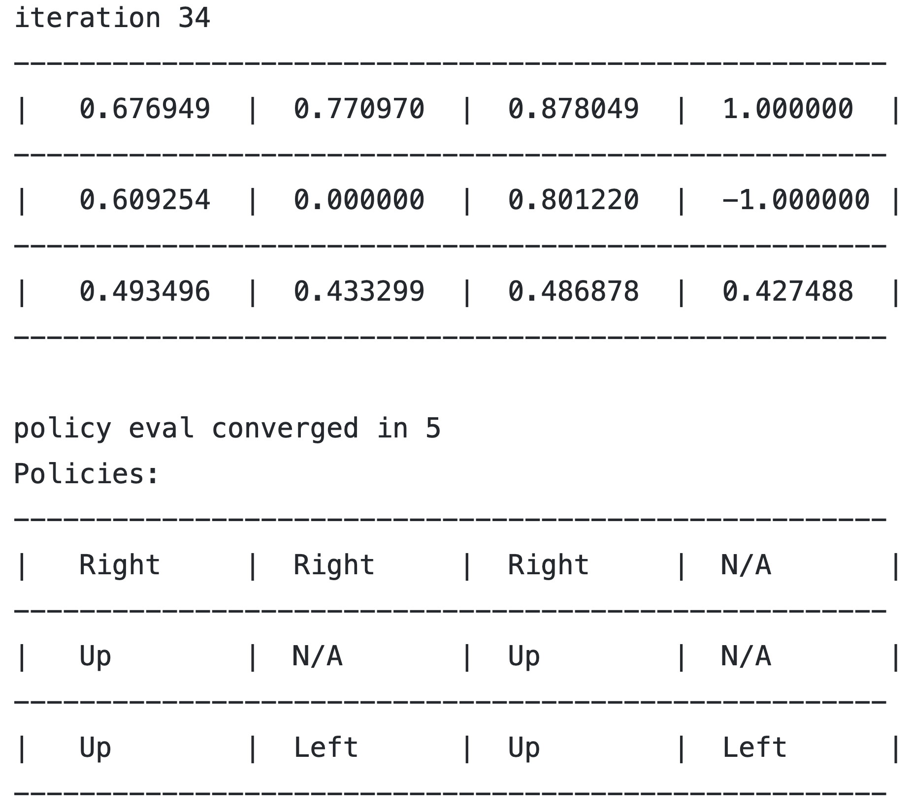
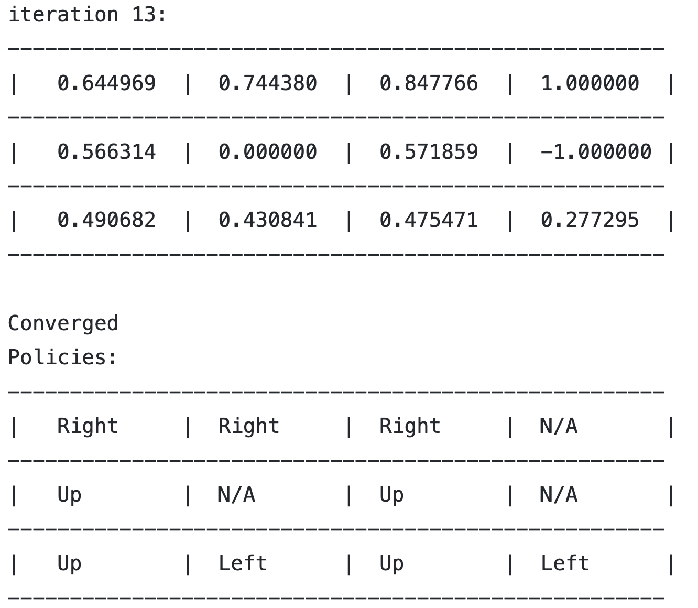

# Reinforcement_Learning
Implementation of basic RL algorithms:
1. Policy Iteration in c++
2. Value Iteration in c++

Policy iteration and value iteration algorithms are implemented based on the board below
 

policy.out, value.out contains the output of running executables policy, value which are compiled from policy_iteration.cc and value_iteration.cc.  

Final output and optimal policy of policy iteration: 
 

Final output and optimal policy of value iteration:  
 